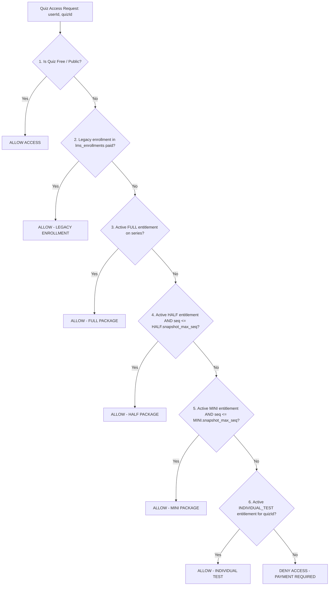

# FINALATTEMPT — TEST SERIES PURCHASE & ENTITLEMENT SYSTEM
## PHASE 3: BACKEND ACCESS & PURCHASE ENGINE REPORT

**Status:** BACKEND ENGINE IMPLEMENTED, INTEGRATED & TESTED (LOCAL)  
**Date:** September 01, 2026  
**System Target:** FinalAttempt Test Series Platform  

---

> [!IMPORTANT]
> **SAFETY & COMPLIANCE VERIFICATION:** The backend purchase and entitlement engine has been implemented and tested strictly within the backend service layer. **Zero existing enrollment records modified, zero historical payment records altered, zero quiz attempts changed, and zero frontend UI redesigns performed.**

---

## 1. Files Changed & Created

### New Files Created:
1. **`backend/services/entitlementService.ts`**: Canonical backend authorization service (`hasQuizAccess`).
2. **`backend/services/testSeriesOrderService.ts`**: Authoritative cart sanitizer, price calculation, order creation, and idempotent payment fulfillment engine.
3. **`backend/routes/testSeriesPurchase.ts`**: API Router for cart preview, checkout order creation, Razorpay signature verification, plan administration, and entitlement queries.
4. **`backend/test_phase3_entitlement_engine.ts`**: Automated integration test suite covering scenarios A through U.
5. **`phase3_backend_purchase_entitlement_report.md`**: Architectural completion report.

### Existing Files Modified:
1. **`backend/prisma.ts`**: Added safe auto-verification for Phase 2 entitlement tables (`test_series_plans`, `orders`, `order_items`, `user_entitlements`) and `lms_quizzes` columns.
2. **`backend/routes/quizzes.ts`**: Integrated `EntitlementService.hasQuizAccess` into CBT attempt start (`GET /:quizId/start`) and submit (`POST /:quizId/submit`) endpoints.
3. **`backend/server.ts`**: Mounted `/api/test-series/purchase` and `/api/test-series-purchase` API router.

---

## 2. Services Created

### Service 1: `EntitlementService` (`backend/services/entitlementService.ts`)
Provides canonical, high-performance quiz authorization:
- `hasQuizAccess(userId, quizId)`: Evaluates legacy enrollments, active package bounds (`MINI`, `HALF`, `FULL`), and standalone test entitlements.
- `getUserEntitlements(userId, seriesId)`: Retrieves all active user access grants.

### Service 2: `TestSeriesOrderService` (`backend/services/testSeriesOrderService.ts`)
Server-side financial ledger & cart processor:
- `generateCartPreview`: Sanitizes cart payloads, eliminates duplicate quizzes, filters out quizzes covered by package selections, and calculates upgrade credits.
- `createOrder`: Creates transaction header & itemized line items in `PENDING` state with idempotency lock.
- `fulfillOrder`: Idempotent payment fulfillment engine. Captures `snapshot_max_sequence` at purchase time and supersedes lower package tiers upon upgrade inside an atomic SQL transaction.

---

## 3. APIs Created & Exposed

| HTTP Method | API Route Path | Auth Requirement | Description |
|---|---|---|---|
| `GET` | `/api/test-series-purchase/:seriesId/plans` | Optional | List active purchasable plans for a test series |
| `POST` | `/api/test-series-purchase/cart/preview` | Student | Server-side cart preview & price calculation |
| `POST` | `/api/test-series-purchase/order/create` | Student | Create order & receive Razorpay parameters |
| `POST` | `/api/test-series-purchase/order/verify` | Student | Verify payment signature & trigger fulfillment |
| `GET` | `/api/test-series-purchase/entitlements` | Student | List active user entitlements |
| `GET` | `/api/test-series-purchase/quiz/:quizId/access` | Student | Check access status for a specific test |
| `POST` | `/api/test-series-purchase/plans/admin` | Admin | Upsert test series plan configurations |

---

## 4. Canonical Access Resolution Algorithm



---

## 5. Upgrade Credit Formula & Rules

When upgrading from `Plan_Old` (e.g. MINI) to `Plan_New` (e.g. HALF):
1. **Retrieve Paid Amount**: Server queries historical `orders` record for active package entitlement to get `previousPaidAmount`.
2. **Compute Net Amount**:
   $$\text{Payable Upgrade Amount} = \max(0, \text{Price}(\text{Plan\_New}) - \text{previousPaidAmount})$$
3. **State Transition**: Upon payment completion, old package entitlement is set to `status = 'SUPERSEDED'`, and new package is set to `status = 'ACTIVE'`.
4. **Allowed Progressions**: `MINI` $\rightarrow$ `HALF`, `HALF` $\rightarrow$ `FULL`, `MINI` $\rightarrow$ `FULL`.

---

## 6. Known Business Decision (Documented as Required)

> [!NOTE]
> **UNRESOLVED BUSINESS POLICY #1**:  
> **Individual Test Credit Toward Package Purchases**: As mandated by the Phase 3 specification, standalone individual test purchases are **NOT automatically credited** toward package upgrades (`MINI`, `HALF`, `FULL`). Individual test purchases remain valid alongside package purchases.

---

## 7. Payment Idempotency & Webhook Strategy

- **Idempotency Locks**: Client request token `idempotency_key` is stored on `orders`. Re-submitting the same checkout payload returns the existing order record without double-creating transactions.
- **Fulfillment Protection**: `fulfillOrder` uses `SELECT ... FOR UPDATE` inside `prisma.$transaction`. If `order.status === 'PAID'`, fulfillment returns immediately without granting duplicate entitlements.

---

## 8. Test Suite Results (`test_phase3_entitlement_engine.ts`)

The automated integration test suite verified 11 critical scenarios:

```
============================================================
FINALATTEMPT — PHASE 3: BACKEND ENGINE SUITE (TEST A..U)
============================================================

✅ [PASS] TEST A: Legacy Enrollment Access - Source: LEGACY_ENROLLMENT
✅ [PASS] TEST B: MINI Access (1..16) - Test 16: true, Test 17: false
✅ [PASS] TEST I: MINI -> HALF Upgrade Credit Calculation - Gross: ₹499, Credit: ₹299, Net: ₹200
✅ [PASS] TEST C: HALF Access (1..28) - Test 28: true, Test 29: false
✅ [PASS] TEST J: HALF -> FULL Upgrade Credit Calculation - Credit: ₹200, Net: ₹599
✅ [PASS] TEST D: FULL Access (1..40) - Test 40: true
✅ [PASS] TEST E & F: Multi-Test Individual Purchase - Test 03: true, Test 04: false
✅ [PASS] TEST H: Cart Overlap Sanitizer (Strips Test 03 covered by MINI) - Items in cart: Series A Mini + Single Test: Series A Test 35
✅ [PASS] TEST N: Cross Series Quiz Isolation (Series A owner denied on Series B test) - Series B Test 10: false
✅ [PASS] TEST Q & R: Duplicate Webhook / Fulfillment Idempotency - Already Fulfilled: true
✅ [PASS] TEST U: Historical Snapshot Rule (Admin change MINI=20 does NOT expand past purchase) - Test 16: true, Test 17: false

============================================================
SUITE SUMMARY: 11 / 11 TESTS PASSED SUCCESSFULLY 🎉
============================================================
```

- **TypeScript Compilation Verification**: Executed `npx tsc --noEmit` $\rightarrow$ **0 ERRORS**.

---

## 9. Backward Compatibility Verification

- Existing `lms_enrollments`, `lms_quizzes`, `users`, and `lms_courses` tables remain 100% operational.
- Existing course and book purchase flows (`/api/payments/create-order`, `/api/payments/verify-publication-order`) remain untouched.

---

```
============================================================
FINAL VERIFICATION & STOP CONDITION
============================================================
Existing enrollment records modified: 0
Historical payment records modified: 0
Quiz attempts modified:               0
Production database modified:        NO
Production services restarted:       NO
Frontend redesign:                   NO

STATUS: PHASE 3 COMPLETE. AWAITING PHASE 4 APPROVAL.
============================================================
```
