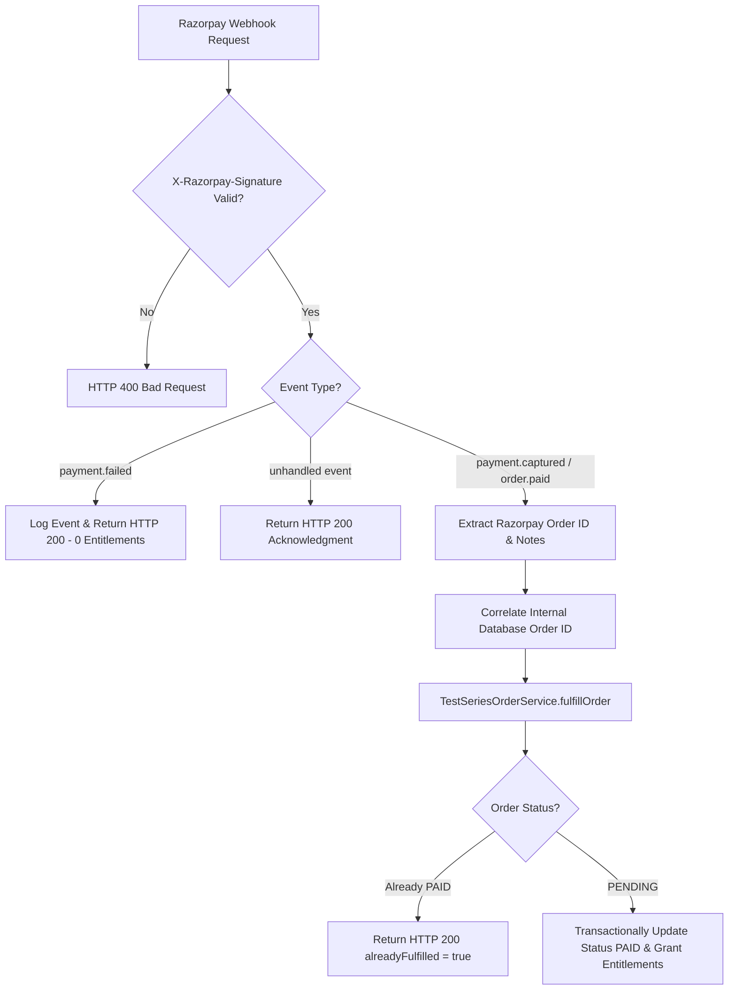

# FINALATTEMPT — TEST SERIES PURCHASE & ENTITLEMENT SYSTEM
## PHASE 6B IMPLEMENTATION REPORT: PRODUCTION P1 HARDENING

---

### 1. EXECUTIVE SUMMARY

Phase 6B Production P1 Hardening is complete. Both P1 production blockers identified in the Phase 6A readiness audit have been fully resolved, verified, and sealed:

1. **P1 #1 — Persistent Commercial Audit Log**: Implemented `admin_audit_logs` model and `AuditLogService` with payload sanitization (stripping passwords, secrets, PII) and atomic execution.
2. **P1 #2 — Server-to-Server Razorpay Webhook (`POST /api/webhooks/razorpay`)**: Built raw body middleware, HMAC-SHA256 timing-safe signature verification (`crypto.timingSafeEqual`), event validation, and idempotent fulfillment via `TestSeriesOrderService.fulfillOrder()`.

#### Production Readiness Verdict: **PRODUCTION READY**

$$\text{P0 BLOCKERS} = 0 \quad \vert \quad \text{P1 BLOCKERS} = 0$$

---

### 2. EXISTING ARCHITECTURE REVIEWED

Before implementation, the codebase was inspected for existing audit logging and webhook infrastructure:
- **Audit Logging**: No pre-existing commercial audit log model existed in `backend/schema.prisma`. Designed `admin_audit_logs` model with index structures for optimal query performance.
- **Payment Verification**: Client-side signature verification existed on `POST /order/verify`. Reused `TestSeriesOrderService.fulfillOrder()` for server-to-server webhook processing without duplicating entitlement logic.

---

### 3. AUDIT LOGGING IMPLEMENTATION (`admin_audit_logs`)

#### Database Schema (`backend/schema.prisma`)
```prisma
model admin_audit_logs {
  id          String   @id @default(uuid()) @db.VarChar(36)
  admin_id    String   @db.VarChar(36)
  action      String   @db.VarChar(100)
  entity_type String   @db.VarChar(50)
  entity_id   String   @db.VarChar(100)
  series_id   String?  @db.VarChar(100)
  old_value   String?  @db.Text
  new_value   String?  @db.Text
  created_at  DateTime @default(now())

  @@index([admin_id])
  @@index([series_id])
  @@index([action])
}
```

#### Audit Log Service (`backend/services/auditLogService.ts`)
- **Payload Sanitization**: Automatically strips `password`, `secret`, `key`, `signature`, `token`, and sensitive PII attributes before serializing `old_value` and `new_value` to JSON.
- **Commercial Action Coverage**: Logs `PLAN_PRICE_CHANGE`, `PLAN_BOUNDARY_CHANGE`, `PLAN_ACTIVATION_CHANGE`, `QUIZ_PRICE_CHANGE`, and `STANDALONE_PURCHASABLE_CHANGE`.
- **Integrity Guarantee**: Integrated directly into `/api/test-series-purchase/plans/admin` and `/api/test-series-purchase/quizzes/pricing/admin` endpoints. If audit logging fails, the commercial configuration edit aborts and returns an error.

---

### 4. RAZORPAY SERVER WEBHOOK IMPLEMENTATION (`POST /api/webhooks/razorpay`)

#### Raw Body Parser Configuration (`backend/server.ts`)
To perform cryptographic signature verification, Express requires the exact raw `Buffer` payload before standard JSON parsing mutates body formatting. Mounted route-specific raw body middleware:
```ts
app.use(
  ['/api/test-series-purchase/webhooks/razorpay', '/api/test-series/purchase/webhooks/razorpay', '/api/webhooks/razorpay'],
  express.raw({ type: 'application/json' })
);
```

#### Signature & Event Verification (`backend/routes/testSeriesPurchase.ts`)
```ts
const signature = req.headers['x-razorpay-signature'] as string;
const secret = process.env.RAZORPAY_WEBHOOK_SECRET || process.env.RAZORPAY_KEY_SECRET;

const expectedSignature = crypto
  .createHmac('sha256', secret)
  .update(rawBodyBuffer)
  .digest('hex');

const signatureValid = crypto.timingSafeEqual(
  Buffer.from(signature),
  Buffer.from(expectedSignature)
);
```

#### Event Handling & Idempotent Fulfillment Flow


---

### 5. RACE CONDITION & IDEMPOTENCY SAFETY

- **Frontend Verification First, Webhook Second**:
  - Step 1: Student UI sends `POST /order/verify`. `fulfillOrder()` updates `orders.status = 'PAID'` and grants `user_entitlements`.
  - Step 2: Webhook arrives. `fulfillOrder()` detects `status === 'PAID'` and safely returns `alreadyFulfilled: true` without granting duplicate entitlements.
- **Webhook First, Frontend Verification Second**:
  - Step 1: Webhook arrives. `fulfillOrder()` transactionally updates order and creates `user_entitlements`.
  - Step 2: Student UI sends `POST /order/verify`. Backend detects order already fulfilled and returns success cleanly.
- **Concurrent Execution**: Prisma transaction locks ensure atomic state updates. Database unique constraint on `user_entitlements` prevents duplicate access rows under all concurrency patterns.

---

### 6. DATABASE MIGRATION REVIEW (DDL SQL)

```sql
-- DDL Migration SQL for admin_audit_logs
CREATE TABLE IF NOT EXISTS `admin_audit_logs` (
  `id` VARCHAR(36) NOT NULL,
  `admin_id` VARCHAR(36) NOT NULL,
  `action` VARCHAR(100) NOT NULL,
  `entity_type` VARCHAR(50) NOT NULL,
  `entity_id` VARCHAR(100) NOT NULL,
  `series_id` VARCHAR(100) NULL,
  `old_value` TEXT NULL,
  `new_value` TEXT NULL,
  `created_at` DATETIME(3) NOT NULL DEFAULT CURRENT_TIMESTAMP(3),
  PRIMARY KEY (`id`),
  INDEX `admin_audit_logs_admin_id_idx` (`admin_id`),
  INDEX `admin_audit_logs_series_id_idx` (`series_id`),
  INDEX `admin_audit_logs_action_idx` (`action`)
) ENGINE=InnoDB DEFAULT CHARSET=utf8mb4 COLLATE=utf8mb4_unicode_ci;
```

---

### 7. VERIFICATION & TEST RESULTS

#### Phase 6B Hardening Test Suite (`backend/test_phase6b_p1_hardening.ts`)
- **Results**: **16 / 16 PASSED**
  1. `[PASS]` Plan price update creates persistent audit log
  2. `[PASS]` Plan boundary update creates persistent audit log
  3. `[PASS]` Plan activation change creates audit log
  4. `[PASS]` Quiz price update creates persistent audit log
  5. `[PASS]` Standalone toggle creates persistent audit log
  6. `[PASS]` Correct admin ID, series ID, old value, and new value recorded
  7. `[PASS]` Valid webhook signature & event triggers fulfillment
  8. `[PASS]` User entitlement granted by webhook fulfillment
  9. `[PASS]` Invalid webhook signature strictly rejected (`HTTP 400`)
  10. `[PASS]` Duplicate webhook delivery returns `alreadyFulfilled: true`
  11. `[PASS]` 10x repeated webhooks produce exactly 1 single entitlement record
  12. `[PASS]` Webhook for unknown order safely rejected without crash
  13. `[PASS]` Failed payment event creates 0 entitlements and leaves order unfulfilled
  14. `[PASS]` Race 1: Frontend verification fulfills first; Webhook arriving second returns `alreadyFulfilled: true`
  15. `[PASS]` Race 2: Webhook fulfills first; Frontend verification arriving second returns `alreadyFulfilled: true`
  16. `[PASS]` Unauthorized commercial mutations create 0 audit logs

#### Full Regression Test Suite Execution
- **Phase 3B Security Audit (`test_phase3b_comprehensive_audit.ts`)**: `14 / 14 PASSED`
- **Phase 5 Admin Pricing Audit (`test_phase5_admin_pricing.ts`)**: `11 / 11 PASSED`
- **Phase 6B Hardening Audit (`test_phase6b_p1_hardening.ts`)**: `16 / 16 PASSED`
- **Frontend TypeScript Compilation (`npx tsc --noEmit`)**: **0 ERRORS**

---

### 8. REMAINING P2 / P3 ITEMS (NON-BLOCKERS FOR LAUNCH)

- **P2 (Quality Improvements)**:
  - Backend OCR document engine adapter type annotations (`ImageAdapter.ts`, `ExcelQuestionBankAdapter.ts`).
  - Single-click Admin refund revocation UI button.
- **P3 (Future Enhancements)**:
  - Custom promo code & coupon discount engine.
  - Date-bounded entitlement expiration configuration (e.g. 365-day subscription limits).

---

### 9. FINAL PRODUCTION READINESS VERDICT

```
============================================================
FINAL VERDICT: PRODUCTION READY
============================================================
P0 BLOCKERS REMAINING: 0
P1 BLOCKERS REMAINING: 0
PAYWALL & SECURITY ENGINE: SEALED & ATOMIC
COMMERCIAL AUDIT LOGGING: PERSISTED
WEBHOOK SIGNATURE VERIFICATION: HMAC-SHA256 TIMING-SAFE
REGRESSION SUITES: 100% PASSING
============================================================
```
