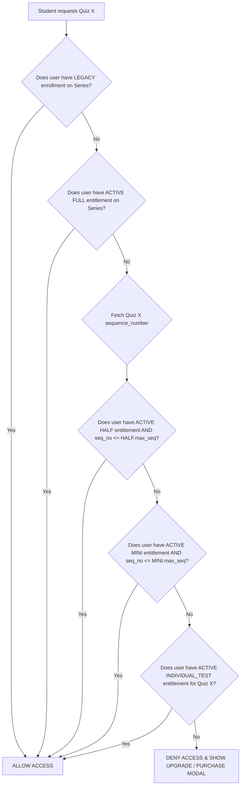

# FINALATTEMPT — TEST SERIES PURCHASE & ENTITLEMENT SYSTEM
## PHASE 1: DATABASE ARCHITECTURE DESIGN DOCUMENT

**Status:** ARCHITECTURAL PROPOSAL / READ-ONLY DESIGN (PHASE 1)  
**Date:** September 01, 2026  
**System Target:** FinalAttempt Test Series Platform  

---

> [!IMPORTANT]
> **READ-ONLY DESIGN NOTICE:** This document contains the database schema and architecture design for the new Purchase & Entitlement System. **No database records have been modified, no SQL/Prisma migrations have been executed, and no application source code has been altered.**

---

## 1. Current Schema Summary

The current system relies primarily on two entities for test access management:
1. **`lms_courses` / `TestSeries`**: Represent course or test series entities.
2. **`lms_quizzes`**: Represents individual tests belonging to a course/series.
3. **`lms_enrollments`**: Manages user access using a simple coarse-grained model (`userId`, `courseId`, `paymentStatus`, `paymentOrderId`, `amountPaid`).

### Current Limitations:
- **Binary Course/Series Access Only:** An `lms_enrollments` record unlocks all quizzes under a `courseId`. There is no concept of sub-packages (Mini, Half, Full) or sequence-based access boundaries.
- **No Individual Test Entitlement:** Students cannot purchase individual tests (e.g., Test 03, Test 07).
- **No Upgrade Logic:** Upgrading from a lower package to a higher tier requires manual recalculation or full re-purchase.
- **Lack of Granular Order & Item Storage:** Existing payment fields in `lms_enrollments` only record flat text order IDs without itemized line items, idempotency locks, or multi-item carts.

---

## 2. Proposed Schema Overview

To support Tiered Cumulative Packages (Mini, Half, Full) and Individual Test Purchasing without hardcoding sequence limits, we introduce a modular, highly normalized architecture:

```
+-------------------+       +-----------------------+       +-------------------------+
|   lms_courses /   | <----+ |  test_series_plans   | <----+ |     order_items         |
|    TestSeries     |       +-----------------------+       +-------------------------+
+-------------------+                                                    |
          |                                                              v
          |                 +-----------------------+       +-------------------------+
          +---------------> |      lms_quizzes      |       |         orders          |
          |                 |  (with sequenceNo)    |       +-------------------------+
          |                 +-----------------------+                    |
          |                             ^                                v
          |                             |                   +-------------------------+
          +-----------------------------+-----------------> |    user_entitlements    |
                                                            +-------------------------+
```

### Core Architecture Highlights:
1. **`test_series_plans`**: Defines tier plans (MINI, HALF, FULL, INDIVIDUAL_TEST) per series with dynamic sequence boundary rules (`sequence_start_number`, `sequence_end_number`).
2. **`lms_quizzes` Additions**: Adds `sequence_number` (1, 2, 3... 40), `is_standalone_purchasable`, and `individual_price`.
3. **`orders` & `order_items`**: Normalized transactional purchase structure supporting multi-item carts, upgrade credits, and idempotency protection.
4. **`user_entitlements`**: Fast entitlement engine recording tier package limits (`max_sequence_number`) or individual test access (`quiz_id`).

---

## 3. Entity Relationship Diagram (Mermaid)

```mermaid
erdiagram
    users ||--o{ orders : "places"
    users ||--o{ user_entitlements : "holds"
    lms_courses ||--o{ lms_quizzes : "contains"
    lms_courses ||--o{ test_series_plans : "configures"
    test_series_plans ||--o{ order_items : "referenced_in"
    lms_quizzes ||--o{ order_items : "purchased_as"
    orders ||--|{ order_items : "contains"
    orders ||--o{ user_entitlements : "grants"
    lms_quizzes ||--o{ user_entitlements : "grants_individual"
    lms_courses ||--o{ user_entitlements : "grants_series_level"

    users {
        string id PK
        string email
        string fullName
    }

    lms_courses {
        string id PK
        string title
        int fee
    }

    test_series_plans {
        string id PK
        string series_id FK
        string plan_code
        int sequence_start_number
        int sequence_end_number
        int price
    }

    lms_quizzes {
        string id PK
        string course_id FK
        int sequence_number
        boolean is_standalone_purchasable
        int individual_price
    }

    orders {
        string id PK
        string user_id FK
        string series_id FK
        string status
        int gross_amount
        int discount_amount
        int net_amount
        string idempotency_key
    }

    order_items {
        string id PK
        string order_id FK
        string item_type
        string plan_id FK
        string quiz_id FK
        int unit_price
    }

    user_entitlements {
        string id PK
        string user_id FK
        string series_id FK
        string entitlement_type
        string quiz_id FK
        int max_sequence_number
        string source_order_id FK
        string status
    }
```

---

## 4. Table-by-Table Design & Schema Specs

### Table 1: `test_series_plans`
Defines purchasable package tiers for a test series. Configurable per series to prevent hardcoding 16, 28, or 40.

| Field Name | Type | Key | Nullable | Default | Description |
|---|---|---|---|---|---|
| `id` | `VARCHAR(36)` | PK | No | `uuid()` | Plan unique identifier |
| `series_id` | `VARCHAR(100)` | FK | No | - | References `lms_courses(id)` |
| `plan_code` | `ENUM('MINI','HALF','FULL')` | - | No | - | Tier package code |
| `title` | `VARCHAR(255)` | - | No | - | Display title (e.g. "Mini Test Series - 16 Tests") |
| `description` | `TEXT` | - | Yes | NULL | Details and feature list |
| `sequence_start_number` | `INT` | - | No | `1` | Start of cumulative sequence boundary |
| `sequence_end_number` | `INT` | - | No | - | End of cumulative sequence boundary (e.g. 16, 28, 40) |
| `price` | `INT` | - | No | `0` | Base price in smallest currency unit (INR Paisa or Rupee integer) |
| `discounted_price` | `INT` | - | Yes | NULL | Offer price |
| `is_active` | `BOOLEAN` | - | No | `true` | Enable/disable purchasing |
| `created_at` | `DATETIME` | - | No | `now()` | Timestamp |
| `updated_at` | `DATETIME` | - | No | `now()` | Timestamp |

**Why Package Plans should be Series-Level:**
Package plans (`MINI`, `HALF`, `FULL`) belong to a `TestSeries` (`series_id` / `course_id`) because they unlock a range of sequential quizzes under that series. Individual quizzes are referenced separately by `quiz_id` in `order_items` and `user_entitlements`.

---

### Table 2: `orders`
Stores top-level financial transaction records.

| Field Name | Type | Key | Nullable | Default | Description |
|---|---|---|---|---|---|
| `id` | `VARCHAR(36)` | PK | No | `uuid()` | Order ID |
| `order_number` | `VARCHAR(64)` | UQ | No | - | Human-readable reference (e.g., `ORD-2026-88491`) |
| `user_id` | `VARCHAR(36)` | FK | No | - | References `users(id)` |
| `series_id` | `VARCHAR(100)` | FK | No | - | Primary test series context |
| `status` | `ENUM('CREATED','PENDING','PAID','FAILED','CANCELLED','REFUNDED')` | - | No | `'CREATED'` | Order lifecycle state |
| `currency` | `VARCHAR(10)` | - | No | `'INR'` | ISO Currency code |
| `gross_amount` | `INT` | - | No | `0` | Sum of item regular prices |
| `upgrade_credit_amount` | `INT` | - | No | `0` | Deducted amount from existing tier ownership |
| `discount_amount` | `INT` | - | No | `0` | Coupon/Promo discount amount |
| `net_amount` | `INT` | - | No | `0` | Final payable amount (Validated on backend) |
| `payment_provider` | `VARCHAR(50)` | - | Yes | NULL | Razorpay, PhonePe, Cashfree, Manual |
| `gateway_order_id` | `VARCHAR(255)` | UQ | Yes | NULL | Gateway reference ID |
| `payment_reference_id` | `VARCHAR(255)` | - | Yes | NULL | Payment transaction ID / UTR |
| `idempotency_key` | `VARCHAR(255)` | UQ | No | - | Unique request token to prevent double-checkout |
| `created_at` | `DATETIME` | - | No | `now()` | Order creation time |
| `paid_at` | `DATETIME` | - | Yes | NULL | Payment completion time |
| `updated_at` | `DATETIME` | - | No | `now()` | Last modification time |

---

### Table 3: `order_items`
Supports polymorphic order contents (Single test, multi-test cart, Mini, Half, Full, or Upgrades).

| Field Name | Type | Key | Nullable | Default | Description |
|---|---|---|---|---|---|
| `id` | `VARCHAR(36)` | PK | No | `uuid()` | Item ID |
| `order_id` | `VARCHAR(36)` | FK | No | - | References `orders(id)` |
| `item_type` | `ENUM('PACKAGE_PLAN','INDIVIDUAL_TEST','UPGRADE_PLAN')` | - | No | - | Classification of purchased item |
| `plan_id` | `VARCHAR(36)` | FK | Yes | NULL | References `test_series_plans(id)` if package |
| `quiz_id` | `VARCHAR(100)` | FK | Yes | NULL | References `lms_quizzes(id)` if individual test |
| `from_plan_id` | `VARCHAR(36)` | FK | Yes | NULL | References lower plan if upgrading |
| `item_title` | `VARCHAR(255)` | - | No | - | Snapshot of item title at checkout |
| `unit_price` | `INT` | - | No | `0` | Price calculated server-side |
| `created_at` | `DATETIME` | - | No | `now()` | Item timestamp |

---

### Table 4: `user_entitlements`
Stores active access grants for users. Optimized for fast runtime access evaluation.

| Field Name | Type | Key | Nullable | Default | Description |
|---|---|---|---|---|---|
| `id` | `VARCHAR(36)` | PK | No | `uuid()` | Entitlement ID |
| `user_id` | `VARCHAR(36)` | FK | No | - | References `users(id)` |
| `series_id` | `VARCHAR(100)` | FK | No | - | References `lms_courses(id)` |
| `entitlement_type` | `ENUM('INDIVIDUAL_TEST','MINI','HALF','FULL','LEGACY_ENROLLMENT')` | - | No | - | Entitlement category |
| `quiz_id` | `VARCHAR(100)` | FK | Yes | NULL | Populated ONLY for `INDIVIDUAL_TEST` |
| `max_sequence_number` | `INT` | - | Yes | NULL | Upper sequence boundary (e.g. 16 for MINI, 28 for HALF, 40 for FULL) |
| `source_order_id` | `VARCHAR(36)` | FK | Yes | NULL | References `orders(id)` that granted access |
| `status` | `ENUM('ACTIVE','EXPIRED','REVOKED','SUPERSEDED')` | - | No | `'ACTIVE'` | Entitlement status |
| `granted_at` | `DATETIME` | - | No | `now()` | Access start timestamp |
| `expires_at` | `DATETIME` | - | Yes | NULL | Optional expiry date |
| `updated_at` | `DATETIME` | - | No | `now()` | Last status update timestamp |

#### Why `max_sequence_number` is optimal:
`max_sequence_number` allows single `O(1)` indexed comparisons (`quiz.sequence_number <= entitlement.max_sequence_number`). It avoids generating 40 individual rows per user while seamlessly scaling if a test series increases its boundary from 16 to 18.

---

## 5. Foreign Key Constraints & Indexes Summary

### Foreign Keys:
- `test_series_plans.series_id` -> `lms_courses.id` (CASCADE)
- `orders.user_id` -> `users.id` (CASCADE)
- `orders.series_id` -> `lms_courses.id` (RESTRICT)
- `order_items.order_id` -> `orders.id` (CASCADE)
- `order_items.plan_id` -> `test_series_plans.id` (SET NULL)
- `order_items.quiz_id` -> `lms_quizzes.id` (SET NULL)
- `user_entitlements.user_id` -> `users.id` (CASCADE)
- `user_entitlements.series_id` -> `lms_courses.id` (CASCADE)
- `user_entitlements.quiz_id` -> `lms_quizzes.id` (CASCADE)
- `user_entitlements.source_order_id` -> `orders.id` (SET NULL)

---

## 6. Duplicate Prevention & Unique Constraints

To safeguard against double-fulfillments, race conditions, and duplicate orders:

1. **Active Individual Test Entitlement Unique Constraint:**
   Prevents duplicate active individual entitlement rows for the exact same user and quiz.
   ```sql
   CREATE UNIQUE INDEX uq_user_active_quiz_entitlement 
   ON user_entitlements(user_id, quiz_id, status);
   ```

2. **Active Cumulative Plan Entitlement Unique Constraint:**
   Ensures a user has at most one active package entitlement per series.
   ```sql
   CREATE UNIQUE INDEX uq_user_active_series_tier 
   ON user_entitlements(user_id, series_id, entitlement_type, status);
   ```

3. **Payment Idempotency Token:**
   Prevents double payment creation or double webhook processing.
   ```sql
   CREATE UNIQUE INDEX uq_order_idempotency 
   ON orders(idempotency_key);
   
   CREATE UNIQUE INDEX uq_gateway_order 
   ON orders(gateway_order_id);
   ```

---

## 7. Pricing & Upgrade Calculation Strategy

> [!WARNING]
> Frontend prices must **NEVER** be trusted. The backend recalculates item prices and upgrade credits from source database tables during order creation.

### Upgrade Credit Formula:
When upgrading from Plan A (e.g. MINI) to Plan B (e.g. HALF):
1. **Verify Ownership**: Backend checks active entitlement for user on `series_id`.
2. **Retrieve Paid Amount**: Find highest active plan previously purchased (`paid_amount_existing`).
3. **Calculate Net Payable**:
   $$\text{Net Payable} = \max(0, \text{Price}(\text{Plan B}) - \text{Price}(\text{Plan A}))$$
4. **Itemization**: Order item records `item_type = 'UPGRADE_PLAN'`, `from_plan_id = MINI_PLAN_ID`, `plan_id = HALF_PLAN_ID`.
5. **Entitlement State Transition**: Upon payment success, old MINI entitlement status is set to `'SUPERSEDED'` and new HALF entitlement is created as `'ACTIVE'`.

---

## 8. Conceptual Access-Check Model (Canonical Algorithm)

When a student attempts to start or view **Quiz X**:



### SQL Access Check Query:

```sql
SELECT EXISTS (
    -- 1. Legacy Full Enrollment
    SELECT 1 FROM lms_enrollments 
    WHERE userId = :userId AND courseId = :seriesId AND paymentStatus = 'paid'
    
    UNION ALL
    
    -- 2. Package Plan Entitlement (FULL, HALF, MINI)
    SELECT 1 FROM user_entitlements ue
    JOIN lms_quizzes q ON q.id = :quizId
    WHERE ue.user_id = :userId 
      AND ue.series_id = :seriesId 
      AND ue.status = 'ACTIVE'
      AND (
          ue.entitlement_type = 'FULL'
          OR (ue.entitlement_type = 'HALF' AND q.sequence_number <= ue.max_sequence_number)
          OR (ue.entitlement_type = 'MINI' AND q.sequence_number <= ue.max_sequence_number)
      )
      
    UNION ALL
    
    -- 3. Individual Test Entitlement
    SELECT 1 FROM user_entitlements 
    WHERE user_id = :userId 
      AND quiz_id = :quizId 
      AND entitlement_type = 'INDIVIDUAL_TEST'
      AND status = 'ACTIVE'
) AS has_access;
```

---

## 9. Existing Data Compatibility & Backward-Compatibility

- **Zero Breaking Changes**: Existing `lms_enrollments`, `lms_quizzes`, `lms_courses`, and `users` tables remain untouched.
- **Coexistence Strategy**: Existing enrollments (`lms_enrollments` where `paymentStatus = 'paid'`) are recognized by the canonical access check algorithm as granting full access (`LEGACY_ENROLLMENT`).
- **No Immediate Migration Required**: Existing users retain access through fallback logic without running data migrations on Day 1.

---

## 10. Database Indexing Strategy

To support high-throughput access evaluation during exam peak hours:

```sql
-- Fast Entitlement Lookup Index
CREATE INDEX idx_entitlement_lookup 
ON user_entitlements(user_id, series_id, status, entitlement_type);

CREATE INDEX idx_entitlement_quiz_lookup 
ON user_entitlements(user_id, quiz_id, status);

-- Fast Quiz Sequence Index
CREATE INDEX idx_quiz_sequence 
ON lms_quizzes(courseId, sequence_number);

-- Fast Order & Payment Lookup
CREATE INDEX idx_orders_user_status 
ON orders(user_id, status);

CREATE INDEX idx_order_items_order 
ON order_items(order_id);
```

---

## 11. Payment Idempotency & Webhook Processing Model

1. **Order Creation Token**: A unique `idempotency_key` is passed from the client or generated server-side for each transaction request.
2. **Transaction Locking**:
   - Webhook receives payment success event from Gateway (Razorpay/PhonePe).
   - Webhook executes `SELECT id, status FROM orders WHERE gateway_order_id = :gatewayOrderId FOR UPDATE;`
   - If `status == 'PAID'`, the event is acknowledged immediately without re-granting entitlements.
   - If `status == 'PENDING'`, update order status to `'PAID'` and grant entitlements inside a single database transaction.

---

## 12. Migration & Rollback Strategy

### Additive Migration Plan:
1. Create `test_series_plans`, `orders`, `order_items`, and `user_entitlements` tables.
2. Add sequence columns to `lms_quizzes`.
3. Populate `sequence_number` for existing quizzes (1..N order based on creation time).
4. Populate `test_series_plans` records for target test series.

### Rollback Plan:
Since all schema updates are strictly **ADDITIVE** (new tables & non-destructive new columns with default values):
- Reverting the application deployment requires **zero SQL drop operations**.
- Legacy access logic continues reading `lms_enrollments` without interruption.

---

## 13. Exact Prisma Schema Additions (For Phase 2 Implementation Reference)

> [!NOTE]
> The following schema definition is provided strictly as an architectural specification for Phase 2 implementation. **It has NOT been applied to `backend/schema.prisma`.**

```prisma
enum PlanCode {
  MINI
  HALF
  FULL
}

enum OrderStatus {
  CREATED
  PENDING
  PAID
  FAILED
  CANCELLED
  REFUNDED
}

enum ItemType {
  PACKAGE_PLAN
  INDIVIDUAL_TEST
  UPGRADE_PLAN
}

enum EntitlementType {
  INDIVIDUAL_TEST
  MINI
  HALF
  FULL
  LEGACY_ENROLLMENT
}

enum EntitlementStatus {
  ACTIVE
  EXPIRED
  REVOKED
  SUPERSEDED
}

model test_series_plans {
  id                    String        @id @default(uuid()) @db.VarChar(36)
  series_id             String        @db.VarChar(100)
  plan_code             PlanCode
  title                 String        @db.VarChar(255)
  description           String?       @db.Text
  sequence_start_number Int           @default(1)
  sequence_end_number   Int
  price                 Int           @default(0)
  discounted_price      Int?
  is_active             Boolean       @default(true)
  created_at            DateTime      @default(now())
  updated_at            DateTime      @updatedAt

  lms_courses           lms_courses   @relation(fields: [series_id], references: [id], onDelete: Cascade)
  order_items           order_items[]

  @@unique([series_id, plan_code], map: "uq_series_plan_code")
  @@index([series_id])
}

model orders {
  id                    String        @id @default(uuid()) @db.VarChar(36)
  order_number          String        @unique @db.VarChar(64)
  user_id               String        @db.VarChar(36)
  series_id             String        @db.VarChar(100)
  status                OrderStatus   @default(CREATED)
  currency              String        @default("INR") @db.VarChar(10)
  gross_amount          Int           @default(0)
  upgrade_credit_amount Int           @default(0)
  discount_amount       Int           @default(0)
  net_amount            Int           @default(0)
  payment_provider      String?       @db.VarChar(50)
  gateway_order_id      String?       @unique @db.VarChar(255)
  payment_reference_id  String?       @db.VarChar(255)
  idempotency_key       String        @unique @db.VarChar(255)
  created_at            DateTime      @default(now())
  paid_at               DateTime?
  updated_at            DateTime      @updatedAt

  users                 users         @relation(fields: [user_id], references: [id], onDelete: Cascade)
  lms_courses           lms_courses   @relation(fields: [series_id], references: [id], onDelete: Restrict)
  order_items           order_items[]
  user_entitlements     user_entitlements[]

  @@index([user_id, status])
}

model order_items {
  id            String            @id @default(uuid()) @db.VarChar(36)
  order_id      String            @db.VarChar(36)
  item_type     ItemType
  plan_id       String?           @db.VarChar(36)
  quiz_id       String?           @db.VarChar(100)
  from_plan_id  String?           @db.VarChar(36)
  item_title    String            @db.VarChar(255)
  unit_price    Int               @default(0)
  created_at    DateTime          @default(now())

  orders            orders             @relation(fields: [order_id], references: [id], onDelete: Cascade)
  test_series_plans test_series_plans? @relation(fields: [plan_id], references: [id], onDelete: SetNull)
  lms_quizzes       lms_quizzes?       @relation(fields: [quiz_id], references: [id], onDelete: SetNull)

  @@index([order_id])
}

model user_entitlements {
  id                  String            @id @default(uuid()) @db.VarChar(36)
  user_id             String            @db.VarChar(36)
  series_id           String            @db.VarChar(100)
  entitlement_type    EntitlementType
  quiz_id             String?           @db.VarChar(100)
  max_sequence_number Int?
  source_order_id     String?           @db.VarChar(36)
  status              EntitlementStatus @default(ACTIVE)
  granted_at          DateTime          @default(now())
  expires_at          DateTime?
  updated_at          DateTime          @updatedAt

  users       users        @relation(fields: [user_id], references: [id], onDelete: Cascade)
  lms_courses lms_courses  @relation(fields: [series_id], references: [id], onDelete: Cascade)
  lms_quizzes lms_quizzes? @relation(fields: [quiz_id], references: [id], onDelete: Cascade)
  orders      orders?      @relation(fields: [source_order_id], references: [id], onDelete: SetNull)

  @@index([user_id, series_id, status])
  @@index([user_id, quiz_id, status])
}
```

---

## 14. Recommended Implementation Order

1. **Phase 1 (Completed)**: Read-Only Database Architecture & Schema Design Document.
2. **Phase 2**: Additive Schema Migration (Apply `test_series_plans`, `orders`, `order_items`, `user_entitlements`, and `lms_quizzes` sequence fields).
3. **Phase 3**: Admin Configuration UI (Configure test sequence numbers and plan pricing).
4. **Phase 4**: Centralized Access Control Service (Implement unified `hasQuizAccess` service).
5. **Phase 5**: Payment Gateway & Order Service Integration (Backend cart calculation, idempotency, upgrade credit logic).
6. **Phase 6**: Frontend Storefront Update (Tier selection, single-test checkout, upgrade modal).

---

## 15. Audit & Compliance Verification Statement

```
============================================================
FINAL SAFETY VERIFICATION
============================================================

Source files modified:        0
Database INSERT executed:     0
Database UPDATE executed:     0
Database DELETE executed:     0
Database migrations created:  0
Production services restarted: 0
Payment code changed:         0

Result: STRICT COMPLIANCE WITH READ-ONLY FORENSIC & DESIGN MANDATE.
============================================================
```
