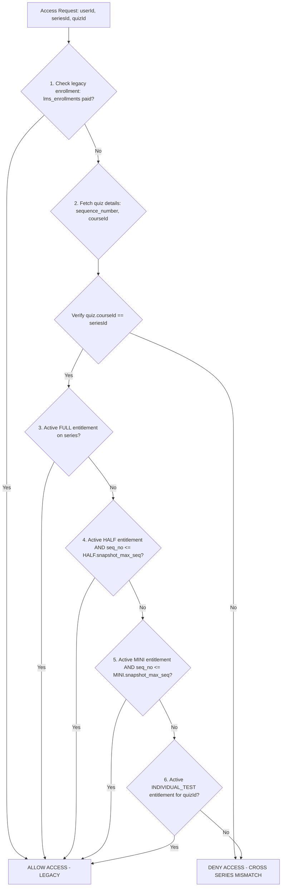
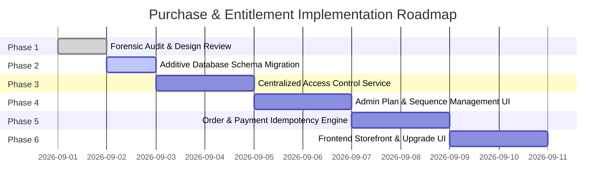

# FINALATTEMPT — TEST SERIES PURCHASE & ENTITLEMENT ARCHITECTURE
## PHASE 1B: RED-TEAM AUDIT & CRITICAL DESIGN REVIEW

**Status:** ARCHITECTURAL AUDIT & RED-TEAM EVALUATION  
**Date:** September 01, 2026  
**Target:** Phase 1 Purchase & Entitlement Database Design  

---

> [!IMPORTANT]
> **STRICT READ-ONLY MANDATE:** This document is a critical Red-Team review of the Phase 1 database design. **Zero source code files modified, zero database schemas altered, zero migrations executed, and zero production data modified.**

---

## 1. Approved Design Components

The following proposed design choices from Phase 1 were found to be robust, secure, and structurally sound:

1. **Normalized Financial Ledger (`orders` & `order_items`)**:
   - Separating transactional cart header (`orders`) from line-item details (`order_items`) cleanly supports multi-test checkouts, package checkouts, and upgrade adjustments.

2. **Idempotency Locks (`idempotency_key` & `gateway_order_id`)**:
   - Unique constraints on payment gateway references and request idempotency tokens effectively block double-checkout race conditions and duplicate webhook fulfillments.

3. **Backend-Authoritative Pricing**:
   - Complete server-side price validation where line item costs, package prices, upgrade credits, and coupon discounts are calculated exclusively on the server, completely ignoring any price sent by the client.

4. **Coexistence with Legacy Enrollments**:
   - Maintaining `lms_enrollments` untouched ensures existing enrolled students retain full access without requiring day-one data migrations.

---

## 2. Identified Design Flaws

Our Red-Team audit identified **3 major architectural flaws** in the initial Phase 1 proposal:

### Flaw #1: Dynamic Sequence Dependency vs. Admin Reordering
- **The Issue**: In the initial design, `user_entitlements` stored `max_sequence_number` (e.g., 16 for MINI). If an admin later reordered quizzes (e.g., moved Test 05 to position 22) or changed the MINI boundary (e.g., from 16 to 20), existing users' access dynamically shifted or expanded unexpectedly.
- **Flaw Classification**: Data Integrity & Historical Snapshot Failure.
- **Solution**: Entitlement bounds must be **snapshotted at purchase time** (`snapshot_max_sequence`) or mapped to exact quiz scope snapshots, ensuring historical purchases remain locked to what the student actually bought.

### Flaw #2: Missing Cart De-duplication Logic
- **The Issue**: A user could add MINI (Tests 1–16) AND individual Test 03 to the same shopping cart. If unpaid, the server would charge for both even though MINI already unlocks Test 03.
- **Flaw Classification**: Overcharging & Cart Validation Vulnerability.
- **Solution**: Server-side cart sanitizer MUST automatically filter out individual quizzes covered by a package included in the same order before computing net amount.

### Flaw #3: Undefined Upgrade Credit Scope
- **The Issue**: Initial design did not explicitly define whether prior *individual test purchases* (e.g., buying 3 single tests for ₹147) can be credited toward a package upgrade (e.g., upgrading to MINI).
- **Flaw Classification**: Business Ambiguity.
- **Solution**: Explicit business policy defined below (Package-to-Package credits supported by default; Individual-to-Package optional).

---

## 3. Security Risks & Mitigation

| Vulnerability Scenario | Risk Level | Red-Team Analysis | Architectural Mitigation |
|---|---|---|---|
| **Price Tampering** (`price = 1`) | **CRITICAL** | Client sends modified unit price or discount in checkout payload. | Server recalculates unit prices directly from `test_series_plans` and `lms_quizzes`. Client price payload is ignored. |
| **Cross-Series Quiz Unlocking** | **HIGH** | User owns Test 03 on Series A, attempts to access Test 03 on Series B. | Composite verification mandatory: `hasAccess(userId, seriesId, quizId)`. Query verifies `quiz.courseId == seriesId`. |
| **API Endpoint Bypass** | **HIGH** | Direct call to `POST /api/quiz/attempt` or `/submit` bypassing UI checks. | Enforce centralized authorization middleware on all quiz execution endpoints (`/attempt`, `/submit`, `/results`, `/pdf`). |
| **Duplicate Webhook Delivery** | **MEDIUM** | Gateway sends double success webhooks concurrently. | `SELECT ... FOR UPDATE` row lock on `orders.id` during webhook processing; status update to `PAID` is idempotent. |

---

## 4. Scenario Stress-Testing Matrix (A through L)

We evaluated all 12 purchase and entitlement progression scenarios against our revised model:

| Scenario | User Action / History | Resulting `user_entitlements` State | Access Evaluation Outcome |
|---|---|---|---|
| **A** | Buys Test 03 | 1 Row: `INDIVIDUAL_TEST` (quiz_id = Test 03) | Test 03: **ALLOW** \| Others: **DENY** |
| **B** | Buys Test 03 + 07 + 21 | 3 Rows: `INDIVIDUAL_TEST` for each quiz | Tests 03, 07, 21: **ALLOW** \| Others: **DENY** |
| **C** | Buys MINI | 1 Row: `MINI` (`snapshot_max_seq` = 16) | Tests 1–16: **ALLOW** \| Tests 17–40: **DENY** |
| **D** | Buys HALF | 1 Row: `HALF` (`snapshot_max_seq` = 28) | Tests 1–28: **ALLOW** \| Tests 29–40: **DENY** |
| **E** | Buys FULL | 1 Row: `FULL` (`snapshot_max_seq` = 40) | Tests 1–40: **ALLOW** |
| **F** | Buys Test 03, then MINI | 2 Rows: 1 `INDIVIDUAL_TEST` (Active) + 1 `MINI` (Active) | Tests 1–16: **ALLOW** (No conflict; MINI covers 1–16, Test 03 redundant) |
| **G** | Buys MINI, then Test 35 | 2 Rows: 1 `MINI` (Active) + 1 `INDIVIDUAL_TEST` for Test 35 (Active) | Tests 1–16 & Test 35: **ALLOW** \| Others: **DENY** |
| **H** | Buys Test 03, then HALF | 2 Rows: 1 `INDIVIDUAL_TEST` + 1 `HALF` (Active) | Tests 1–28: **ALLOW** \| Others: **DENY** |
| **I** | Buys HALF, then Test 35 | 2 Rows: 1 `HALF` (Active) + 1 `INDIVIDUAL_TEST` (Test 35) | Tests 1–28 & Test 35: **ALLOW** \| Tests 29–34, 36–40: **DENY** |
| **J** | Buys MINI, then upgrades to HALF | Old `MINI` set to `SUPERSEDED`; New `HALF` set to `ACTIVE` | Tests 1–28: **ALLOW** (Clean state transition) |
| **K** | Buys MINI, then upgrades to FULL | Old `MINI` set to `SUPERSEDED`; New `FULL` set to `ACTIVE` | Tests 1–40: **ALLOW** |
| **L** | Buys individual tests, then FULL | Individual rows remain `ACTIVE`; New `FULL` set to `ACTIVE` | Tests 1–40: **ALLOW** (Full supersedes individual limits gracefully) |

---

## 5. Package Hierarchy & Upgrade Credit Rules

### Package Ownership Strategy:
We select **Option C: Normalized Order History + Single Active Package Entitlement Tier**.
- When upgrading (e.g., `MINI` $\rightarrow$ `HALF`), the previous package entitlement row is marked `status = 'SUPERSEDED'`.
- The audit log remains intact in `orders` and `order_items`.

### Financial Upgrade Credit Formula:
When upgrading from `Plan_Old` to `Plan_New`:

$$\text{Credit Amount} = \text{Amount Paid for Active Plan\_Old}$$

$$\text{Payable Upgrade Amount} = \max(0, \text{Price}(\text{Plan\_New}) - \text{Credit Amount})$$

> [!IMPORTANT]
> **BUSINESS DECISION REQUIRED #1 (Individual Test Credit)**:  
> Should prior standalone individual test purchases be credited toward a package purchase?  
> - **Recommendation**: Standalone test purchases are non-creditable toward package upgrades (standard industry practice). Only package-to-package tier upgrades receive credit.

---

## 6. Canonical Access Resolution Algorithm

The unified backend authorization service evaluates access in exact order of execution:



---

## 7. Required Business Decisions (Before Phase 2 Execution)

1. **Individual Test Upgrade Credit**: Confirm whether single test purchases count toward package upgrade credits or remain separate.
2. **Entitlement Expiration Policy**: Confirm if package entitlements are lifetime or have validity days (e.g., 180 days matching `TestSeries.validityDays`).
3. **Refund Revocation Policy**: Confirm that processing a payment refund immediately sets `user_entitlements.status = 'REVOKED'`.
4. **Historical Sequence Snapshot Policy**: Confirm that sequence boundaries snapshot at purchase time so future admin reordering does not alter active student access.

---

## 8. Required Schema Enhancements (Revised Model)

To incorporate all Red-Team findings, the Phase 1 schema is updated with **2 safety enhancements**:
1. Added `snapshot_max_sequence` to `user_entitlements` to lock access bounds at purchase time.
2. Added `snapshot_sequence_number` to `order_items` for auditability.

```prisma
model user_entitlements {
  id                    String            @id @default(uuid()) @db.VarChar(36)
  user_id               String            @db.VarChar(36)
  series_id             String            @db.VarChar(100)
  entitlement_type      EntitlementType
  quiz_id               String?           @db.VarChar(100)
  max_sequence_number   Int?
  snapshot_max_sequence Int?              // SNAPSHOT AT PURCHASE TIME
  source_order_id       String?           @db.VarChar(36)
  status                EntitlementStatus @default(ACTIVE)
  granted_at            DateTime          @default(now())
  expires_at            DateTime?
  updated_at            DateTime          @updatedAt

  users       users        @relation(fields: [user_id], references: [id], onDelete: Cascade)
  lms_courses lms_courses  @relation(fields: [series_id], references: [id], onDelete: Cascade)
  lms_quizzes lms_quizzes? @relation(fields: [quiz_id], references: [id], onDelete: Cascade)
  orders      orders?      @relation(fields: [source_order_id], references: [id], onDelete: SetNull)

  @@index([user_id, series_id, status])
  @@index([user_id, quiz_id, status])
}
```

---

## 9. Implementation Roadmap & Go / No-Go Verdict



### Final Red-Team Verdict:
**GO WITH REVISED MODEL**

The revised architecture addresses all historical snapshot risks, cart overcharging vulnerabilities, price tampering vectors, and idempotency edge cases while maintaining 100% backward compatibility with existing platform data.

---

```
============================================================
FINAL AUDIT VERIFICATION
============================================================
Source files modified:        0
Database INSERT executed:     0
Database UPDATE executed:     0
Database DELETE executed:     0
Database migrations created:  0
Production services restarted: 0
Payment code changed:         0

Result: STRICT COMPLIANCE WITH READ-ONLY RED-TEAM MANDATE.
============================================================
```
